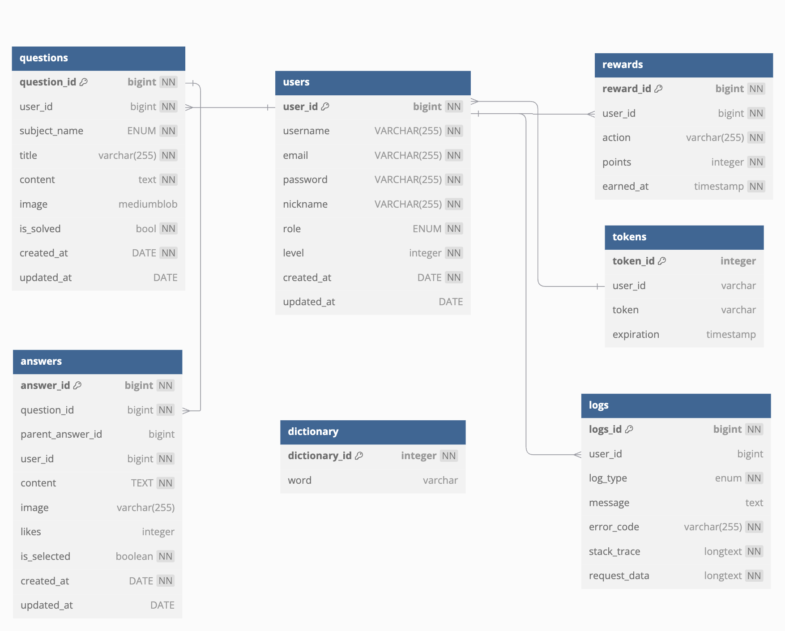

# study-together

## 개요

- 학생들은 장소와 시간에 구애받지 않고 학습할 수 있는 환경을 필요로 합니다.
- 학습을 할때 내가 모르는 걸 질문해서 답변받을때도 성장하지만, 다른 사람에게 내가 아는 부분에 대해서 설명할때에도 성장합니다. 그래서 학생-선생님 으로 나누어지지 않고 **누구나 학생인 동시에 선생님이 될 수 있는 서비스**를 구현했습니다.

## 구현 기능

### 사용자/관리자 기능
- 회원가입 기능
    - 사용자는 모든 글을 조회할 수 있지만, 질문과 답변 작성은 회원가입한 사용자만 가능하다.
    - 회원가입시 아이디, 비밀번호, 이메일, 닉네임을 입력해 등록하고, 아이디, 이메일과 닉네임은 중복될 수 없다.
- 로그인, 로그아웃 기능
    - 질문과 답변 기능은 로그인 한 사용자만 사용할 수 있다.
    - 비로그인시 글 조회 가능
- 기본 로그인은 JWT 기반으로 제공한다.
    - 기본 로그인은 JWT 기반으로 제공한다.
    - 사용자는 OAuth로 로그인할 수 있다. (구글 로그인 제공)
- 사용자 정보(개인정보) 수정 기능
    - 사용자는 사용자 정보(이름, 닉네임, 비밀번호)를 수정할 수 있다.
- 관리자 기능
    - 사용자가 등록한 글을 수정하거나 삭제할 수 있다.
- 사용자 정보 조회 기능
    - 사용자가 작성한 글 개수
    - 사용자가 작성한 답변 개수
    - 채택된 답변의 개수
    - 답변 채택이 10회 이상일 경우 등급이 사용자 닉네임과 함께 노출
      
### 문제 등록 기능
- 문제 등록 기능
    - 사용자는 문제를 등록할 수 있다.
    - 문제 등록 시 질문 내용과 과목(국어, 영어, 수학)을 필수로 등록한다.
    - 사용자는 질문 내용 작성 시 텍스트와 이미지를 모두 사용할 수 있다.
    - 제목, 텍스트(질문 내용), 이미지(옵션), 과목(국어, 영어, 수학)을 포함(필수 항목)
    - 사용자는 문제에 관련된 이미지를 등록할 수 있다.
        - 이미지는 multipart/form-data 방식으로 등록한다.
- 문제 조회 기능
    - 사용자는 과목별로 등록된 문제를 조회할 수 있다.
    - 사용자 별로 등록한 문제를 조회할 수 있다.
    - 사용자가 답변한 문제 별로 조회할 수 있다.
    - 모든 조회 기능은 pagenation 기반으로 데이터가 제공되며, 페이지 별 최대 10개의 데이터가 노출된다.
- 문제 수정 기능
    - 사용자는 자신이 등록한 문제를 수정할 수 있다.
    - 사용자는 자신이 답변한 문제를 수정할 수 있다. 단, 채택된 답변은 수정할 수 없다.
- 문제 삭제 기능
    - 사용자는 자신이 등록한 문제를 삭제할 수 있다.
    - 단, 채택된 답변이 있는 경우 문제를 삭제할 수 없다.
 
### 답변 기능
- 답변 기능
    - 사용자는 댓글을 통해 질문에 대해 답변을 등록할 수 있다. (텍스트, 이미지)
    - 답변은 등록 이후에도 수정이 가능하다. 단, 채택된 답변인 경우 삭제가 불가능하다.
    - 사용자는 답변을 삭제할 수 있다. 단, 대댓글이 달린 댓글은 삭제 할 수 없다.
- 답변 좋아요, 취소 기능
    - 사용자는 답변에 대해 좋아요를 누를 수 있다.
    - 사용자는 답변에 좋아요를 취소할 수 있다.
- 대댓글 기능
    - 사용자는 작성된 답변에 대해 추가적인 댓글을 작성할 수 있다.
- 답변 채택 기능
    - 질문자는 댓글 중 마음에 드는 답변을 채택 할 수 있다.

### 포인트 획득 기능
- 1일 1문제 챌린지
    - 사용자는 하루에 한 번 다른 사용자가 등록한 질문에 답변을 작성하고 포인트를 획득할 수 있다.
    - 챌린지 달성 보상은 1일 최초 10 포인트 후 문제를 풀 경우 3 포인트를 얻을 수 있다.
    - 연속 달성 보너스를 지급한다.
        - 7일 연속 달성 시 50 포인트를 지급한다.
        - 15일 연속 달성 시 150 포인트를 지급한다.
        - 30일 연속 달성 시 300 포인트를 지급한다.
- 질문 등록 보상
    - 사용자가 질문을 등록하면 5 포인트를 지급한다.
- 답변 채택 보상
    - 답변이 질문자에 의해 채택되면 20 포인트를 지급한다.

### 포인트 사용 기능
- 포인트 상점
    - 사용자는 모은 포인트를 사용하여 플랫폼 내에서 다양한 아이템이나 혜택을 구매할 수 있다.
    - 문제 우선 노출 기능
        - 50 포인트를 사용하여 1일간 상위에 우선 노출시킬 수 있다.

 ### 내용 검열 기능(문제, 답변)
- 사용자는 금지된 단어를 문제, 답변 작성시 사용할 수 없다.
    - 사용자가 질문과 답변 입력시 금지된 단어가 있는지 확인 후 금지된 단어가 있을시 오류가 발생한다.
    - '부적절한 단어가 포함된 내용으로 등록이 불가합니다.' 예외 발생  

## ERD

## WBS

[개발계획서 확인하기](https://docs.google.com/spreadsheets/d/18YZ0-OuTypVbIbnMl6kPdKGM3txDf3VCotl0mbziRT8/edit?gid=2096235861#gid=2096235861)

